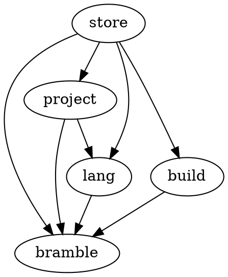

Currently most code is in the bramble pkg. This package contains starlark logic, store manipulation and build. It would be nice if it was broken down into clearer functional parts.

The store is a core component, I think the store package should be extended to include derivations. Derivations are simply a thing that is stored in the store.

We could have a lang package that implements all starlark functionality.

Then a build package for bramble build?

We need somewhere for the over-the-wire build protocol.


-----------------

store handles storage and builds
builds are independent of packages and projects, they just build derivations that are returned by project and lang

-----------------------
lang has a dependency on store, it would be nice if it was self-contained
currently it needs access to the store in order to:
- write source files to the store
- put files in the star cache

----------------------

- lang doesn't import store.
- source files are archived and a reference to their location on the filesystem is returned
- use a cache library to store starlark cache
- return derivation that is mostly starlark types, an internal representation that can be hashed for caching (skip the sourcefile check)
- higher level lib handles conversion between starlark derivation and real derivation

-------

ok, so derivations complicate this, we kind of want our own version of a
derivation for the lang package, but we also need to inject hashes from other
derivations into the templates. if we imagine we're a library that is implementing
language support for bramble, then it's not too bad if lang is using store and
wrapping the native drv. so we use the native drv, but wrapped. we probably
want to stick the tools that hash up the sources into the project package.
calculating derivation inputs belongs outside of lang.

another thought: we want lib owners to be able to construct json derivations
that are linked to each other and then submit them for builds.

no, lang is external, anyone should be able to use lang, we just happen to use a
specific lang frontend, bramble could support multiple lang frontends, so just
use all the libs you need....?

-----------------

Store is a storage of various derivations and files
Build takes derivation inputs in graph form and the builds them into the store
Project handles project structure
Lang handles starlark files, code execution, modules, dependencies, imports

-----------------

can we eval and return all derivations without using the store/project?
do we ever need hashes during script evaulation?

runtime is overloaded, can we just pass the config to the language runtime?

-----------------
Anatomy of a build:

run `build ./lib:foo`

1. Confirm that a bramble store exists and is set up.
2. Confirm that we're within a project and that the project config is valid
3. Search within the project for the path and function name that are listed.
    - Needs project config module name and project location
4. Execute the starlark code
   - Will read all of the project
   - Will also need access to any modules we have locally
   - Doesn't need the store unless we expect it to write sources to the store in this step
   - problem: we do need to inject template string values into derivations and these are innacurate without the source files
   - they are also innacurate if they are unbuilt, so consider accepting that they are innacurate
5. Get all returned derivations that were parsed along with the specific thing we want to build
6. Build the final derivation and any dependent derivations, ensure that we patch up the graph at the same time
   - Need access to store, source files
   - Need hashmap of url hashes from config
7. Store any new hashes in config

Possible "interface", just to illustrate boundaries and ergonomics
```go
type ExecModuleInput struct {
    WorkingDirectory string
    Command          string
	Arguments        []string
	ProjectLocation  string
	ModuleName       string
}

type ExecModuleOutput struct {
	Output         []Derivation
	AllDerivations []Derivation
}

type BuildInput struct {
	Build        []Derivation
	Dependencies []Derivation
	URLHashes    map[string]string
}

type BuildOutput struct {
	BuiltDerivations []Derivation
	NewURLHashes     map[string]string
}

type Bramble interface {
    NewProject(wd string) (*Project, error)
    NewStore(bramblePath string) (*Store, error)
    ExecModule(input ExecModuleInput) (ExecModuleOutput, error)
    Build(input BuildInput) (BuildOutput, error)
}
```
