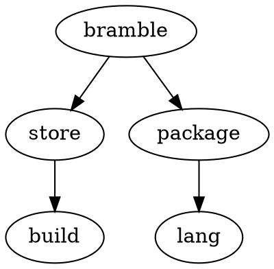

Currently most code is in the bramble pkg. This package contains starlark logic, store manipulation and build. It would be nice if it was broken down into clearer functional parts.

The store is a core component, I think the store package should be extended to include derivations. Derivations are simply a thing that is stored in the store.

We could have a lang package that implements all starlark functionality.

Then a build package for bramble build?

We need somewhere for the over-the-wire build protocol.

-----------------

store handles storage and builds
builds are independent of packages and projects, they just build derivations that are returned by project and lang
