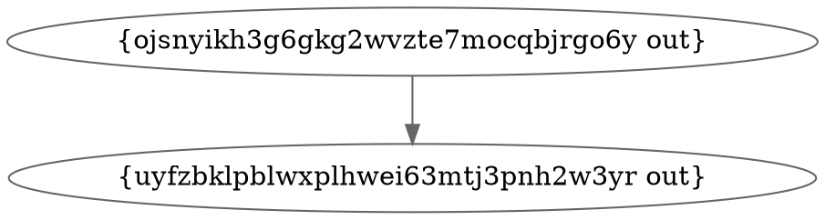
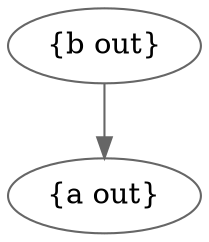
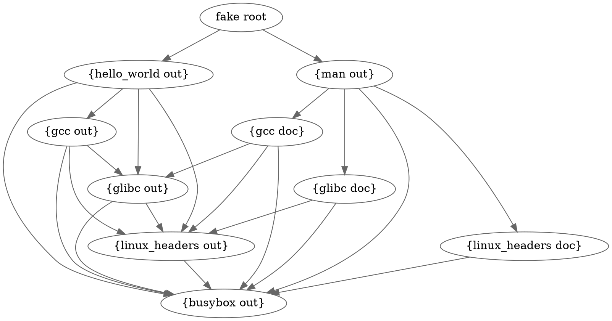
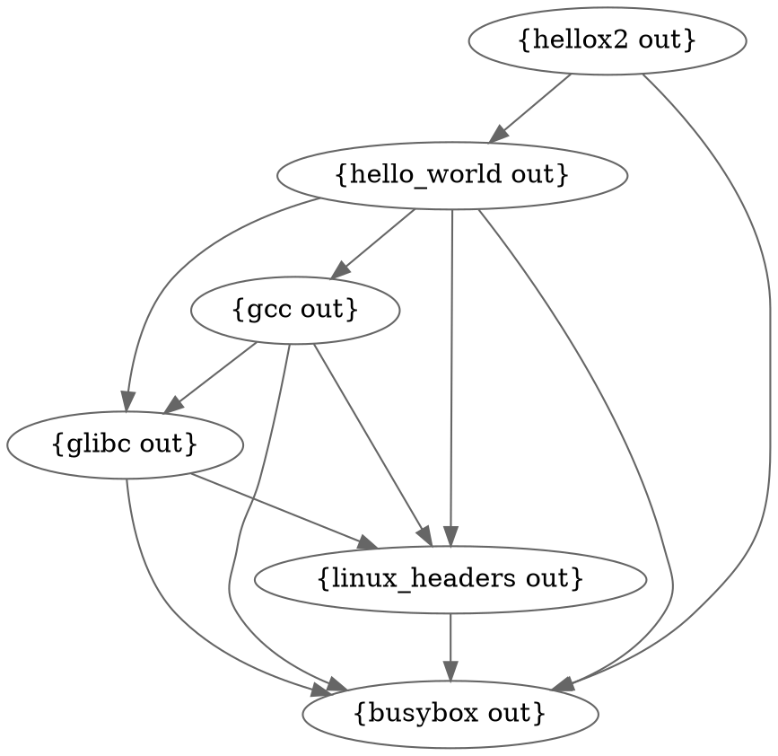
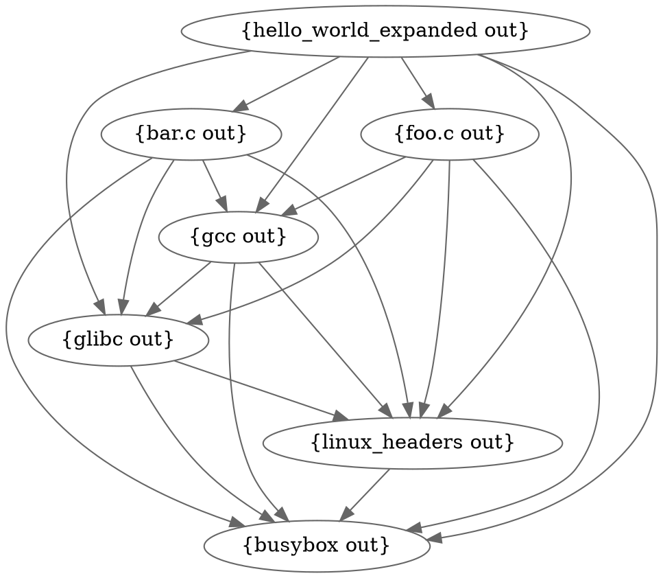

<h1>Derivation Walk and Patch</h1>

- [Intro](#intro)
- [What do derivations look like](#what-do-derivations-look-like)
- [Many derivations, multiple outputs](#many-derivations-multiple-outputs)
- [Preparing a derivation for building](#preparing-a-derivation-for-building)
- [Derivations that generate derivations](#derivations-that-generate-derivations)

## Intro
The high level steps of a bramble build are as follows:

1. Parse starlark config files and call a single build function.
2. Take any derivations that have been returned by the function call and assemble all dependency derivations.
3. Build the output derivations and dependency derivations into a graph.
   - Nodes/vertexes are derivation outputs and edges are dependencies.
   - That way we can start with derivations that have zero dependencies and walk the graph to the outputs as each node is built.
4. Walk the graph, building each derivation once its dependencies have been built.

Walking the derivation graph is complicated and requires a few tricky steps. This document walks through the walk.

## What do derivations look like


Here's a simple derivation defined in a `.bramble` file. `a` has no dependencies and `b` depends on `a`.

```python
def atob():
    a = derivation("a", "a")
    return derivation("b", a.out, args=[a.out])
```

After parsing and hashing each derivation we end up with an internal representation that looks like this:
```json
{
    "ojsnyikh3g6gkg2wvzte7mocqbjrgo6y": {
        "Args": [
            "{{ uyfzbklpblwxplhwei63mtj3pnh2w3yr:out }}"
        ],
        "Builder": "{{ uyfzbklpblwxplhwei63mtj3pnh2w3yr:out }}",
        "Name": "b",
        "Outputs": ["out"]
    },
    "uyfzbklpblwxplhwei63mtj3pnh2w3yr": {
        "Args": null,
        "Builder": "a",
        "Dependencies": null,
        "Name": "a",
        "Outputs": ["out"]
    }
}
```

Each derivation has a hash (which is used as the key in this object/map) and various attributes. Derivations reference each other with reference strings like `{{ uyfzbklpblwxplhwei63mtj3pnh2w3yr:out }}`. These strings contain the hash along with the specific output that is needed by the child derivation. When assembling the dependency graph, these template strings are used to calculate which derivation outputs are depended on by a specific derivation.

A build graph of the derivations above looks like so:

<p align=center></p>
<details>
<summary><sub><sup>graphviz src</sub></sup></summary>


</details>


We use hashes to identify derivations because a graph of derivations is a [merkle tree](https://en.wikipedia.org/wiki/Merkle_tree). Every derivation contains references to its dependencies. If any of those dependencies change the hash of that derivation changes. For the rest of this document we'll use the derivation name instead of the hash to identify the derivations, but you can assume that we're actually referencing hashes in the real implementation instead. Therefore, the above graph would actually look like this. How nice.

<p align=center></p>

<details>
<summary><sub><sup>graphviz src</sub></sup></summary>


</details>

## Many derivations, multiple outputs

Let’s look at a more complicated example. The following code is the rough derivation structure for compiling a “Hello World” program with `gcc`. Any code or build scripts have been omitted for brevity.

```python
def gcc_hello_world():
    bb = derivation("busybox", "fetch_url", env={"url": "foo"})
    linux_headers = derivation("linux_headers", bb.out + "/bin/sh", outputs=["out", "doc"])
    glibc = derivation("glibc", bb.out + "/bin/sh", env={"linux_headers": linux_headers.out}, outputs=["out", "doc"])
    gcc = derivation("gcc", bb.out + "/bin/sh", env={"linux_headers": linux_headers.out, "glibc": glibc.out}, outputs=["out", "doc"])
    man = derivation("man", bb.out + "/bin/sh", env={"linux_headers": linux_headers.doc, "glibc": glibc.doc, "gcc": gcc.doc}, outputs=["out"])
    hello = derivation("hello_world", bb.out + "/bin/sh", env={"linux_headers": linux_headers.out, "glibc": glibc.out, "gcc": gcc.out})
    return [man, hello]
```

It’s a little complicated to read though. Let’s look at one line:

```python
glibc = derivation("glibc", bb.out + "/bin/sh", env={"linux_headers": linux_headers.out}, outputs=["out", "doc"])
```

Glibc is being built. The builder is the `sh` binary from the busybox derivation. Glibc is compiled using just busybox and linux headers (a contrived example, likely not feasible in the real world). The linux headers output `.out` is passed as an environment variable so that it can be referenced within the build. The glibc derivation has two outputs `out` and `doc`; `out` contains the build output and `doc` contains documentation output.

This function has two derivation outputs `[man, hello]`. The first is the man pages output and the second is our “hello world” output. The man pages derivation takes the docs output from glibc, gcc and linux_headers. All together the dependency graph for these derivations looks like this:

<p align=center></p>

<details>
<summary><sub><sup>graphviz src</sub></sup></summary>



</details>


Since there are two outputs a “fake root” is used to construct a valid directed acyclic graph with a single root. Each output is broken out into a single node so that derivations only depend on the outputs they specifically need.

When a build starts it starts with dependencies and walks up the tree until it gets to root of the graph. Each derivation output is visited once. When a node is visited a lock is taken on the specific derivation and the build begins. If an existing copy of the derivation and its outputs is found on disk that output is returned.

## Preparing a derivation for building

When a build finishes we have to prepare dependent derivations for the build step. Derivations normally contain template strings referencing a derivation and its output name. Before building we want to replace these template strings with the on-disk location of the output. Before being prepared for a build, the body of the "b" derivation looks like so:

```json
{
  "Args": [
    "{{ uyfzbklpblwxplhwei63mtj3pnh2w3yr:out }}"
  ],
  "Builder": "{{ uyfzbklpblwxplhwei63mtj3pnh2w3yr:out }}",
  "Name": "b",
  "Outputs": [
    "out"
  ]
}
```

Once "a" has finished building it returns the output location. The "out" output for "a" is at `4oymiquy7qobjgx36tejs35zeqt24qpe`. The template string `{{ uyfzbklpblwxplhwei63mtj3pnh2w3yr:out }}` is replaced with the store path plus the output hash. Our local store path `/home/maxm/bramble/bramble_store_padding/bramble_`, but it will be different depending on your system. Combine those together, replace the original template string and you get this derivation.

```json
{
  "Args": [
    "/home/maxm/bramble/bramble_store_padding/bramble_/4oymiquy7qobjgx36tejs35zeqt24qpe"
  ],
  "Builder": "/home/maxm/bramble/bramble_store_padding/bramble_/4oymiquy7qobjgx36tejs35zeqt24qpe",
  "Name": "b",
  "Outputs": [
    "out"
  ]
}
```

From here we hand the derivation to the builder knowing that the paths point to real on-disk paths and not template strings.


## Derivations that generate derivations

Building a static derivation graph is relatively straightforward, but what about derivations that output other derivations? In certain instances we want to support a derivation that creates other derivations. This could be very helpful with ergonomics. Think about a few instances:

1. A c compiler creates a derivation graph for all files that need to be compiled.
2. A program scans a go.mod and creates a new derivation for every dependency that needs to be downloaded.
3. A derivation will scan source files for dependencies that are needed and then replace itself with a graph of derivations that build the dependencies needed for that project.

These kinds of use cases are difficult to support directly without generating code in advance. If a build ever has certain insights or information that could be used to better define the build graph we can't currently take advantage of that information. At the same time we must ensure that we use that information in a way that still follows our build rules. (TODO: what build rules?)

Let's go back to the "hello world" compilation example. What if instead of a single source file we're compiling a complicated source tree? We could just build them all in the same derivation, but that would mean we need to re-compile all source files when any of them change. Ideally each source file (or set or source files) would be in a separate derivation so that unchanged files are cached.

Let's remove the man pages build and cut the graph down to just the build steps so that we can get a simple view.

<p align=center></p>

<details>
<summary><sub><sup>graphviz src</sub></sup></summary>



</details>

We've added `hellox2` as well. Let's pretend `hellox2` is a job that uses the `hello_world` output to print "Hello World" to a file twice. This will help demonstrate that we'll need to manually patch any dependencies of a replaced node in the graph.

So let's say we build the graph and `hello_world` outputs a new derivation graph instead of compiling directly. It outputs the following graph:

<p align=center></p>


<details>
<summary><sub><sup>graphviz src</sub></sup></summary>



</details>

This graph is very similar to our build graph because the outputted build steps need all the same dependencies to compile individual source files. You can see that `foo.c` and `bar.c` have been added. Let's pretend these are both source files that will output something like `foo.o` and `bar.o` and the final `hello_world_expanded` output will take those object files and combine them into a final binary.

From here we'll need to update the existing build graph to support these additions. Doing that will involve the following steps:


1. Remove the `hello_world` node now that it has outputted derivations:

	<p align=center></p>


	<details>
	<summary><sub><sup>graphviz src</sub></sup></summary>

	```dot
	digraph {
		compound = "true"
		newrank = "true"
      	graph [truecolor=true bgcolor="#00000000"]
      	node [style=filled fillcolor="#ffffff" color="#666666"]
      	edge [color="#666666"]
		subgraph "root" {
			"{hello_world out}" [fillcolor = red, style=filled]
			"{hello_world out}" -> "{glibc out}"
			"{hello_world out}" -> "{linux_headers out}"
			"{hello_world out}" -> "{gcc out}"
			"{hello_world out}" -> "{busybox out}"
			"{hellox2 out}" -> "{hello_world out}"
			"{hellox2 out}" -> "{busybox out}"
			"{glibc out}" -> "{linux_headers out}"
			"{glibc out}" -> "{busybox out}"
			"{linux_headers out}" -> "{busybox out}"
			"{gcc out}" -> "{glibc out}"
			"{gcc out}" -> "{linux_headers out}"
			"{gcc out}" -> "{busybox out}"
		}
	}
	```

	</details>

2. Merge the graph output of `hello_world` with the build graph. The lighter green nodes are replaced with identical nodes and they've already been built. The dark green nodes are new and need to be built.

	<p align=center></p>

	<details>
	<summary><sub><sup>graphviz src</sub></sup></summary>

	```dot
	digraph {
		compound = "true"
		newrank = "true"
	graph [truecolor=true bgcolor="#00000000"]
	node [style=filled fillcolor="#ffffff" color="#666666"]
	edge [color="#666666"]
		subgraph "root" {
			"{hello_world_expanded out}" [fillcolor = green, style=filled]
			"{foo.c out}" [fillcolor = green, style=filled]
			"{bar.c out}" [fillcolor = green, style=filled]


			"{gcc out}" [fillcolor = darkseagreen1, style=filled]
			"{glibc out}" [fillcolor = darkseagreen1, style=filled]
			"{linux_headers out}" [fillcolor = darkseagreen1, style=filled]

			"{bar.c out}" -> "{busybox out}"
			"{bar.c out}" -> "{gcc out}"
			"{bar.c out}" -> "{glibc out}"
			"{bar.c out}" -> "{linux_headers out}"
			"{foo.c out}" -> "{busybox out}"
			"{foo.c out}" -> "{gcc out}"
			"{foo.c out}" -> "{glibc out}"
			"{foo.c out}" -> "{linux_headers out}"
			"{gcc out}" -> "{busybox out}"
			"{gcc out}" -> "{glibc out}"
			"{gcc out}" -> "{linux_headers out}"
			"{glibc out}" -> "{busybox out}"
			"{glibc out}" -> "{linux_headers out}"
			"{hello_world_expanded out}" -> "{bar.c out}"
			"{hello_world_expanded out}" -> "{busybox out}"
			"{hello_world_expanded out}" -> "{foo.c out}"
			"{hello_world_expanded out}" -> "{gcc out}"
			"{hello_world_expanded out}" -> "{glibc out}"
			"{hello_world_expanded out}" -> "{linux_headers out}"
			"{hellox2 out}" -> "{busybox out}"
			"{hellox2 out}" -> "{hello_world_expanded out}"
			"{linux_headers out}" -> "{busybox out}"
		}
	}
	```

	</details>


3. `hellox2` now still contains a reference to `{ hello_world out }`. Patch this derivation so that is now contains references to `{ hello_world_expanded out }` instead.

4. Continue walking the graph and building un-built nodes.

For now there are some rules with this approach:

1. Derivations that expand must have a single output. Supporting multiple outputs adds some complexity if the original derivation and the derivation that replaces it don't have the same outputs. We could arguably just support multiple outputs if they are identical, but it requires running the derivation to confirm this so it seems easier to just enforce a fixed output.
2. What happens if derivations keep expanding over and over and over again? Can an expanded derivation create more expanded derivations? For the moment we ensure that none of the expanded derivations have builder `derivation_output` so that this can't happen. Might be nice to support this in the future with some kind of limit.
