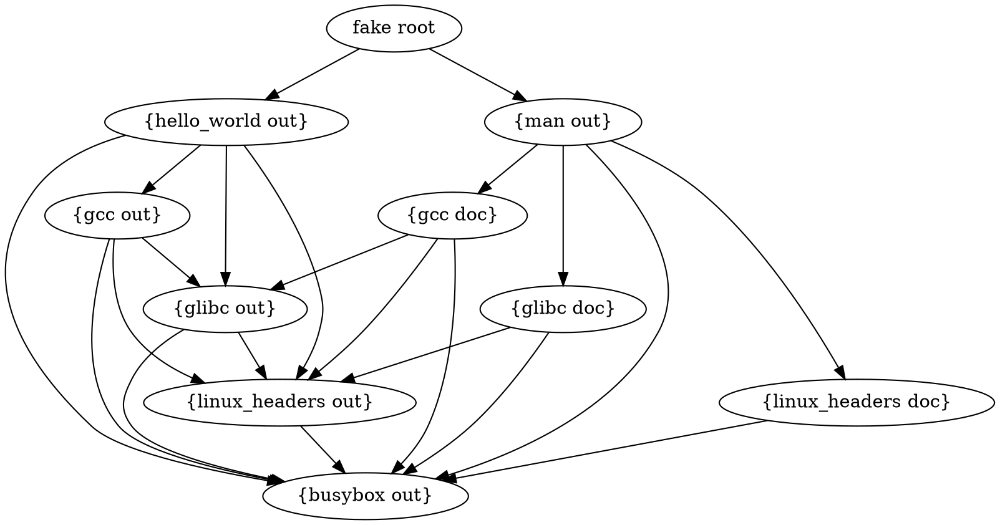
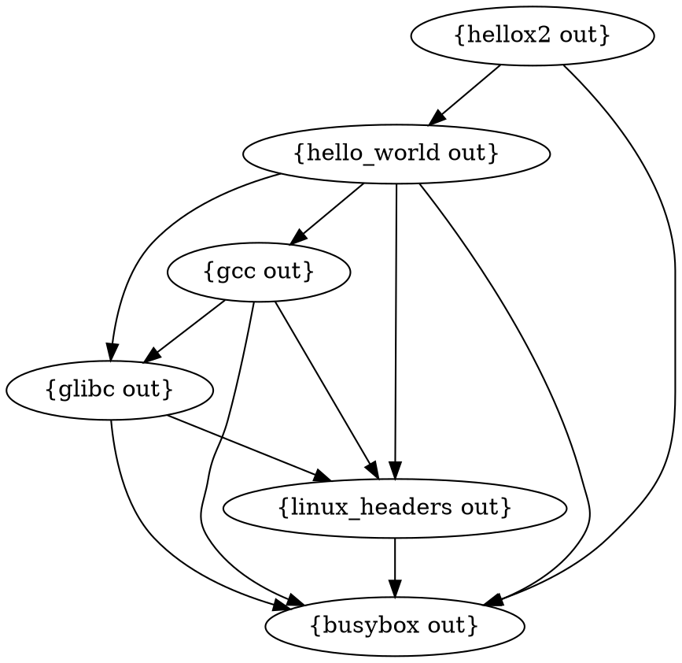
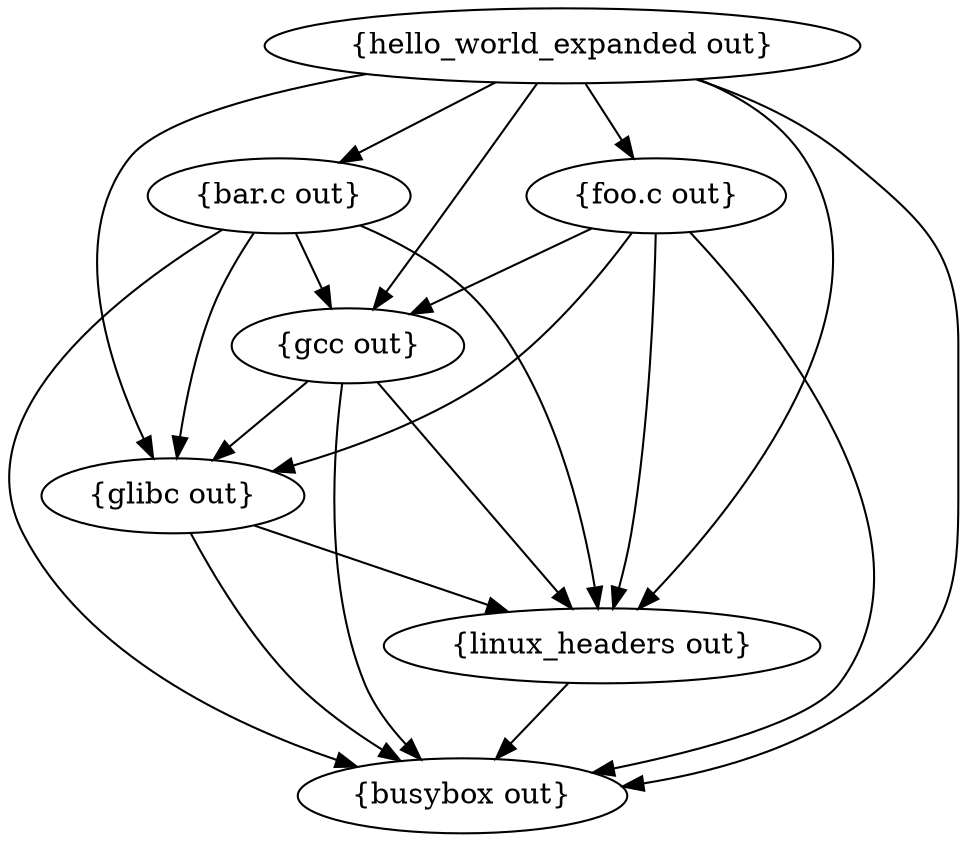
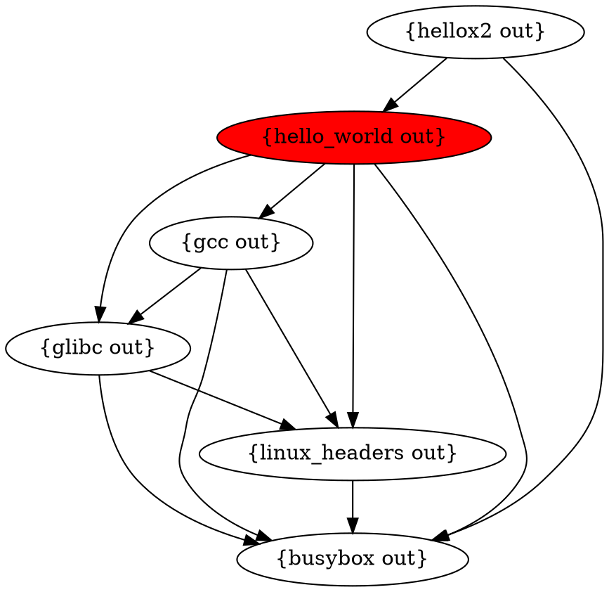
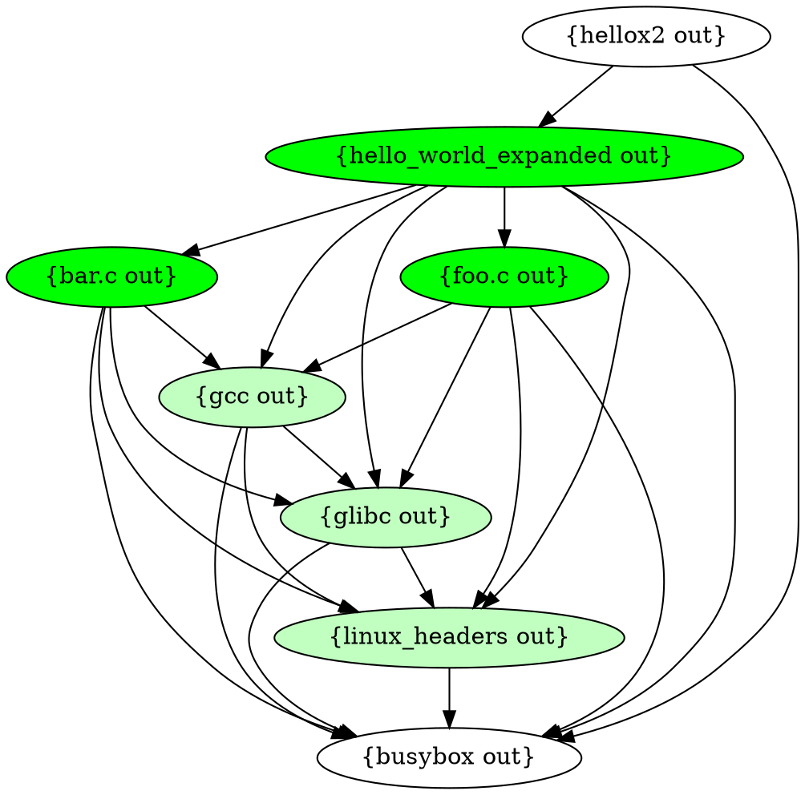

# Bramble Derivation Walk and Patch

A few fields have been removed, but generally derivations look like this after they are generated from a starlark configuration.
```json
{
    "ojsnyikh3g6gkg2wvzte7mocqbjrgo6y": {
        "Args": [
            "{{ uyfzbklpblwxplhwei63mtj3pnh2w3yr:out }}"
        ],
        "Builder": "{{ uyfzbklpblwxplhwei63mtj3pnh2w3yr:out }}",
        "Name": "b",
        "Outputs": ["out"]
    },
    "uyfzbklpblwxplhwei63mtj3pnh2w3yr": {
        "Args": null,
        "Builder": "a",
        "Dependencies": null,
        "Name": "a",
        "Outputs": ["out"]
    }
}
```

Each derivation has a hash (which is used as the key in this object/map) and various attributes. Derivations reference each other with reference strings like `{{ uyfzbklpblwxplhwei63mtj3pnh2w3yr:out }}`. These strings contain the hash along with the specific output that is needed by the child derivation. When assembling the dependency graph, these template strings are used to calculate which derivation outputs are depended on by a specific derivation.

A build graph of the derivations above looks like so:


Let’s look at a more complicated example. The following code is the rough derivation structure for compiling a “Hello World” program with `gcc`. Any code or build scripts have been omitted for brevity.

```python
def gcc_hello_world():
    bb = derivation("busybox", "fetch_url", env={"url": "foo"})
    linux_headers = derivation("linux_headers", bb.out + "/bin/sh", outputs=["out", "doc"])
    glibc = derivation("glibc", bb.out + "/bin/sh", env={"linux_headers": linux_headers.out}, outputs=["out", "doc"])
    gcc = derivation("gcc", bb.out + "/bin/sh", env={"linux_headers": linux_headers.out, "glibc": glibc.out}, outputs=["out", "doc"])
    man = derivation("man", bb.out + "/bin/sh", env={"linux_headers": linux_headers.doc, "glibc": glibc.doc, "gcc": gcc.doc}, outputs=["out"])
    hello = derivation("hello_world", bb.out + "/bin/sh", env={"linux_headers": linux_headers.out, "glibc": glibc.out, "gcc": gcc.out})
    return [man, hello]
```

It’s a little complicated to read though. Let’s look at one line:

```python
glibc = derivation("glibc", bb.out + "/bin/sh", env={"linux_headers": linux_headers.out}, outputs=["out", "doc"])
```

Glibc is being built. The builder is the `sh` binary from the busybox derivation. Glibc is compiled using just busybox and linux headers (a contrived example, not feasible in the real world). The linux headers output `.out` is passed as an environment variable so that it can be referenced within the build. The glibc derivation has two outputs “out” and “doc”; “out” contains the build output and “doc” contains documentation output.

This function has two derivation outputs, our man pages output and our “hello world” output. The man pages derivation takes the docs output from glibc, gcc and linux_headers. All together the dependency graph for these derivations looks like this:


<details>
<summary>graphviz src</summary>



</details>


Since there are two outputs a “fake root” is used to construct a valid directed acyclic graph with a single root. Each output is broken out into a single node so that derivations only depend on the outputs they specifically need.

When a build starts it starts with dependencies and walks up the tree until it gets to root of the graph. Each derivation output is visited once. When a node is visited a lock is taken on the specific derivation and the build begins. If an existing copy of the derivation and its outputs is found on disk that output is returned.

When a build finishes the template strings in all connected derivations are replaced with paths to the on-disk output. In our first example we have a two-step build. The body of the "b" derivation is:

```json
{
  "Args": [
    "{{ uyfzbklpblwxplhwei63mtj3pnh2w3yr:out }}"
  ],
  "Builder": "{{ uyfzbklpblwxplhwei63mtj3pnh2w3yr:out }}",
  "Name": "b",
  "Outputs": [
    "out"
  ]
}
```

Once "a" has finished building it returns the output location. The "out" output for "a" is at `4oymiquy7qobjgx36tejs35zeqt24qpe`. The template string `{{ uyfzbklpblwxplhwei63mtj3pnh2w3yr:out }}` is replaced with the store path plus the output hash. Our local store path `/home/maxm/bramble/bramble_store_padding/bramble_`, but it will be different depending on your system. This is what the "b" derivation would look like before it starts building. With this step complete the derivation builder can expect the derivation to reference paths when it is run.

```json
{
  "Args": [
    "/home/maxm/bramble/bramble_store_padding/bramble_/4oymiquy7qobjgx36tejs35zeqt24qpe"
  ],
  "Builder": "/home/maxm/bramble/bramble_store_padding/bramble_/4oymiquy7qobjgx36tejs35zeqt24qpe",
  "Name": "b",
  "Outputs": [
    "out"
  ]
}
```


## Graph Expansion

Building a static derivation graph is relatively straightforward, but what about derivations that output other derivations? In certain instances we want to support a derivation that creates other derivations. This could be very helpful with ergonomics. Think about a few instances:

1. A c compiler creates a derivation graph for all files that need to be compiled.
2. A program scans a go.mod and creates a new derivation for every dependency that needs to be downloaded.
3. A derivation will scan source files for dependencies that are needed and then replace itself with a graph of derivations that build the dependencies needed for that project.

These kinds of use cases are difficult to support directly without generating code in advance. If a build ever has certain insights or information during a build that could be used to better define the build graph we can't currently take advantage of that information. At the same time we must ensure that we use that information in a way that still follows our build rules.

Let's go back to the "hello world" compilation example. What if instead of a single source file we're compiling a complicated source tree? We could just build them all in the same derivation, but that would mean we need to re-compile all source files when any of them change. Ideally each source file (or set or source files) would be in a separate derivation so that unchanged files are cached.

Let's remove the man pages build and cut the graph down to just the build steps so that we can get a simple view.


<details>
<summary>graphviz src</summary>



</details>

We've added `hellox2` as well. Let's pretend this is a job that uses the `hello_world` output to print "Hello World" to a file twice. This will help demonstrate that we'll need to manually patch any dependencies of a replaced node in the graph.

So let's say we build the graph and `hello_world` outputs a new derivation graph instead of compiling directly. It outputs the following graph:


<details>
<summary>graphviz src</summary>



</details>

This graph is very similar to our build graph because the outputted build steps need all the same dependencies to compile individual source files. To update the graph we'll take the following steps.


1. Remove this node:


<details>
<summary>graphviz src</summary>



</details>

2. Merge the graph output of hello_world with the previous build graph.


<details>
<summary>graphviz src</summary>



</details>


3. `hellox2` now still contains a reference to `{ hello_world out }`. Patch this derivation so that is now contains references to `{ hello_world_expanded out }`.

4. Continue walking the graph and building un-built nodes.


For now there are some rules with this approach:

1. Derivations that expand must have a single output. Supporting multiple outputs adds some complexity if the original derivation and the derivation that replaces it don't have the same outputs. We could arguably just support multiple outputs if they are identical, but it requires running the derivation to confirm this so it seems easier to just enforce a fixed output.
2. What happens if derivations keep expanding over and over and over again? Can an expanded derivation create more expanded derivations? For the moment we ensure that none of the expanded derivations have builder `derivation_output` so that this can't happen. Might be nice to support this in the future with some kind of limit.
